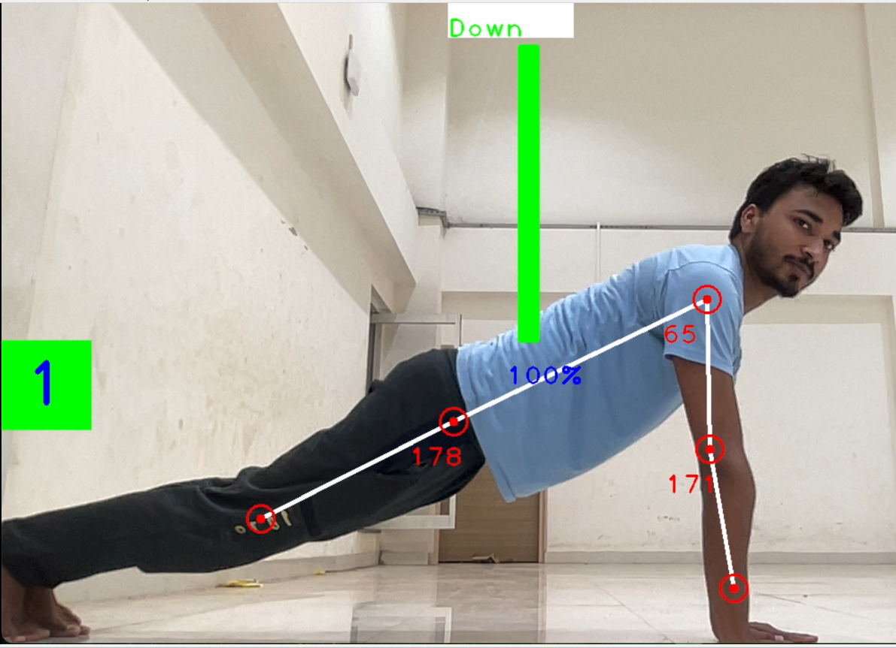

# Fitness Pose Detector
This project uses the OpenCV library to detect human poses in images or video streams, and provides exercise-specific measurements for pushups, bench presses, and sitting positions.

## Requirements
To run this project, you need to have the following software installed:

- Python 3.x
- OpenCV library (version 4.5.4 or later)
- Numpy library (version 1.19.5 or later)
- Mediapipe

# Usage
## Counting Correct Pushups
To count the number of correct pushups in an image or video stream, run the following command:

``` python push_up.py ```
# output



## Checking Sitting Position
To check if you are sitting properly in an image or video stream, run the following command:

``` python sitting_position.py ```


## Counting Correct Bench Presses
To count the number of correct bench presses in an image or video stream, run the following command:

``` python bench_press.py ```


The pose detector will generate keypoint locations on the human body and then calculate the angles and lengths for different exercises based on the relative positions of these keypoints.

# Output
The pose detector will output the number of correct pushups or bench presses, or a message indicating whether you are sitting properly or not.

# Contributing
Contributions are welcome! If you find any bugs or have any suggestions for improving this project, please open an issue or pull request on the GitHub repository.

# License
This project is licensed under the MIT License.
