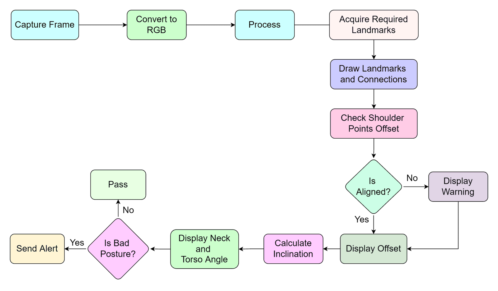

# Fitness Pose Detector
The Fitness Pose Detector is an innovative computer vision project that utilizes the OpenCV library to detect human poses in images and video streams. This project is designed to assist individuals in improving their exercise techniques and achieving optimal workout results by providing exercise-specific measurements for pushups, bench presses, and sitting positions.

The primary vision behind this project is to enable individuals to perform their exercises with the correct form and technique, which is essential for avoiding injuries and maximizing the benefits of each exercise. The Fitness Pose Detector works by using a deep learning algorithm that analyzes each frame of a video stream or image to detect and track key points on the human body, such as the elbows, knees, and hips.

Using these key points, the Fitness Pose Detector can accurately determine the position and orientation of the human body, which is then used to calculate the exercise-specific measurements. For example, during pushups, the Fitness Pose Detector can measure the distance between the hands and the ground, the angle of the elbows, and the overall posture of the body. This information can be used to provide feedback to the user on their technique and form.

The Fitness Pose Detector is a highly technical project that requires a deep understanding of computer vision, machine learning, and programming. The OpenCV library provides a powerful set of tools for building computer vision applications, including image and video processing, feature detection, and machine learning algorithms.

To implement the Fitness Pose Detector, the OpenCV library is used to capture and process video streams or images. The deep learning algorithm used for pose detection is typically based on Convolutional Neural Networks (CNNs), which are trained on large datasets of annotated images to learn to recognize and locate key points on the human body.

The Fitness Pose Detector is a prime example of how computer vision technology can be used to improve human performance and health. By providing real-time feedback on exercise technique and form, this project can help individuals achieve their fitness goals and avoid injuries. As such, it represents a promising development in the field of health and wellness technology.

In addition to the pose detection model, we are also running a parallel neural network model to detect gym equipment in the scene. This model can identify objects like dumbbell rods, weight plates, and other gym equipment, and can provide additional information about the exercise being performed. By combining these two models, we can provide a comprehensive analysis of a person's workout routine, including their posture, form, and equipment usage. This can be incredibly useful for gym-goers, personal trainers, and anyone looking to improve their fitness and technique.

## Flowchart

## Requirements
To run this project, you need to have the following software installed:

- Python 3.x
- OpenCV library (version 4.5.4 or later)
- Numpy library (version 1.19.5 or later)
- Mediapipe

# Usage
## Counting Correct Pushups
To count the number of correct pushups in an image or video stream, run the following command:

``` python push_up.py ```

### output
<table>
  <tr>
    <td>correct</td>
     <td>incorrect</td>
  </tr>
  <tr>
    <td></td>
    <td></td>
  </tr>
 </table>

## Checking Sitting Position
To check if you are sitting properly in an image or video stream, run the following command:

``` python sitting_position.py ```


### output
<table>
  <tr>
    <td>correct</td>
     <td>incorrect</td>
  </tr>
  <tr>
    <td></td>
    <td></td>
  </tr>
 </table>
## Counting Correct Bench Presses
To count the number of correct bench presses in an image or video stream, run the following command:

``` python bench_press.py ```

## Counting Correct dumbbell bicep curls
To count the number of dumbbell bicep curls in an image or video stream, run the following command:

``` python curl.py ```
### output


## Counting Correct Side lateral raise
To count the number of Side lateral raise in an image or video stream, run the following command:

```python rep.py ```

### output


The pose detector will generate keypoint locations on the human body and then calculate the angles and lengths for different exercises based on the relative positions of these keypoints.


# Contributing
Contributions are welcome! If you find any bugs or have any suggestions for improving this project, please open an issue or pull request on the GitHub repository.

# License
This project is licensed under the MIT License.
